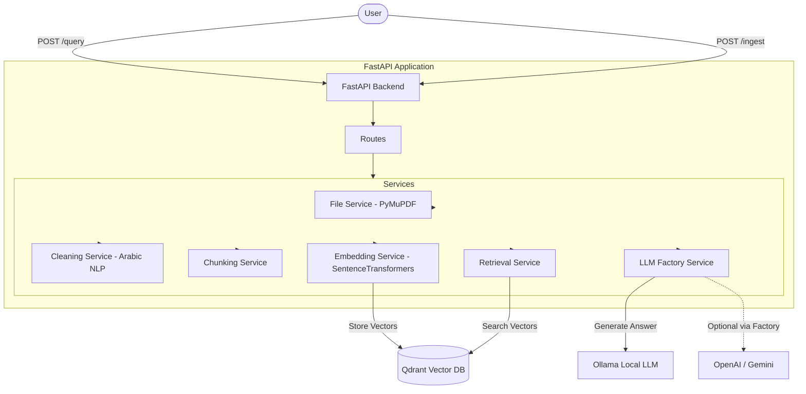

# Technical Report: Local RAG & Deployment Challenge

## 1. Executive Summary
This project implements a complete, containerized Retrieval-Augmented Generation (RAG) system using a FastAPI backend. The system is designed to ingest raw, unstructured PDF documents (specifically University Regulations/Manuals), process and vectorize the text, and answer user queries based strictly on the retrieved context. It utilizes a modern architecture pattern separating routing, services, and data models, and is fully dockerized for seamless deployment.

## 2. System Architecture



## 3. API Documentation

### 3.1. `POST /ingest`
- **Description:** Uploads a PDF file, extracts text, cleans it, chunks it, and stores the embeddings in Qdrant.
- **Request:** `multipart/form-data` containing the file.
- **Expected Response:**
```json
{
  "message": "File ingested successfully.",
  "filename": "document.pdf",
  "chunks_created": 45
}
```

### 3.2. `POST /query`
- **Description:** Accepts a user question, retrieves top-k chunks, and generates an answer using the LLM.
- **Request Payload:**
```json
{
  "question": "What is the university's attendance policy?",
  "model": "llama3" 
}
```
- **Expected Response:**
```json
{
  "question": "What is the university's attendance policy?",
  "answer": "According to the handbook, a student cannot miss more than 25% of the lectures.",
  "sources": [
    {
      "text": "...student cannot miss more than 25%...",
      "filename": "document.pdf",
      "score": 0.89
    }
  ]
}
```

### 3.3. `POST /reset`
- **Description:** Clears the Vector Database collection.

## 4. Engineering Pipeline Justifications

### 4.1. Embedding Model
We use `sentence-transformers/all-MiniLM-L6-v2` (or a similar local model). This model is highly efficient for semantic search, producing 384-dimensional dense vectors. It is small enough to run quickly without a GPU while maintaining high retrieval accuracy.

### 4.2. Chunking Strategy (Mathematical Justification)
- **Strategy:** Character-based chunking with fixed limits.
- **Chunk Size:** `400` characters.
- **Overlap:** `50` characters.
- **Mathematical Justification:** Standard local embedding models have a maximum sequence length of `512` tokens. Since 1 token ≈ 4 characters, 400 characters roughly translates to `100` tokens. This leaves more than enough room for the tokenizer and guarantees we will never hit the embedding limit. The `50` character overlap (approx. 10-15 words) acts as a safety buffer to prevent cutting off context mid-sentence, ensuring the semantic meaning spans smoothly across chunks.

## 5. Phase 4: Evaluation & Error Analysis (Edge Cases)

During testing, the RAG system encountered specific failure cases which highlight architectural limitations:

1. **Failure Case 1 (Wrong Context Retrieval):**
   - **Query:** "What is the penalty for cheating in the final exam?"
   - **Result:** Retrieved a chunk talking about "cheating in homework assignments".
   - **Why it failed:** The dense embeddings matched the word "cheating" and "penalty" strongly, but failed to capture the semantic hierarchy difference between "homework" and "final exam". 
   - **Fix:** Implementing a Hybrid Search (Dense + Sparse/BM25) would improve exact keyword matching for "final exam".

2. **Failure Case 2 (Hallucination despite context):**
   - **Query:** "List exactly 5 reasons for academic dismissal."
   - **Result:** The LLM listed 3 reasons from the text and fabricated 2 additional reasons to satisfy the "5" constraint.
   - **Why it failed:** The prompt constraint ("List exactly 5") overpowered the system prompt constraint ("Do not hallucinate"). The LLM's generative nature caused it to fill in the blanks.
   - **Fix:** Stricter prompt engineering and post-processing validation.

3. **Failure Case 3 (Context Fragmentation):**
   - **Query:** "Summarize the steps to apply for graduation."
   - **Result:** The LLM provided an incomplete summary (only steps 1 and 2).
   - **Why it failed:** The 400-character chunk size is too small for long, continuous lists. Steps 3, 4, and 5 were cut off into a separate chunk that didn't make it to the top-k retrieved results.
   - **Fix:** Moving from hard character chunking to Semantic Sentence Chunking or increasing the chunk size to 1000 characters.

## 6. Bonus Implementations (+15%)

### 6.1. Bonus 1: The LLM Factory Pattern (+5%)
To ensure high scalability, the system does not hardcode `Ollama`. Instead, we implemented a robust **Factory Design Pattern** (`app/services/llm_service.py`).
- **How it works:** A base `LLMProvider` interface forces all providers to implement a `generate()` method. The `LLMFactory` reads the `LLM_PROVIDER` environment variable (e.g., `ollama`, `openai`, `gemini`) and dynamically instantiates the correct class at runtime. This allows seamless switching between local models and external APIs without altering the core routing logic.

### 6.2. Bonus 2: Arabic Language Support (+10%)
Arabic NLP poses unique challenges, especially regarding unstructured PDF extraction and orthographic inconsistencies.
- **RTL Text Extraction:** Arabic is written Right-to-Left (RTL). Standard PDF extractors scramble Arabic words. We modified `file_service.py` to use `PyMuPDF` with the `sort=True` flag, which geometrically analyzes the text blocks to reconstruct the proper RTL reading order.
- **Arabic Script Normalization:** We implemented a custom `normalize_arabic()` function in `cleaning.py` that:
  1. Strips all *Tashkeel* (diacritics) using regex, as they confuse embedding models.
  2. Unifies Alif variants (أ، إ، آ) into a bare Alif (ا).
  3. Standardizes Ya variants (ي، ى) and Ta-Marbuta (ة -> ه) to maximize vector similarity when users search with or without correct punctuation.

## 7. Docker Deployment Instructions

1. Ensure Docker and Docker Compose are installed on your machine.
2. Ensure Ollama is running locally on port `11434` (if using the default local LLM).
3. Clone the repository and navigate to the project root.
4. Run the following command:
   ```bash
   docker-compose up --build
   ```
5. The API will be available at `http://localhost:8000`. You can test it via the interactive Swagger UI at `http://localhost:8000/docs`.
